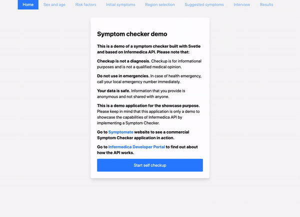

## Svelte Symptom Checker Example

This is an example of a symptom checker app based on [Svelte framework (compiler)](https://svelte.dev/). The base web app was created with [sveltejs/template](https://github.com/sveltejs/template), while the code is bundled with [rollup.js](https://rollupjs.org/guide/en/) and compiled by Svelte into regular JavaScript. It uses [Infermedica API](https://infermedica.com/product/infermedica-api?utm_source=github&utm_medium=referral&utm_campaign=github) v3 supported by Artificial Intelligence to perform symptom analysis.

The app also includes a simple proxy built with [Node.js](https://nodejs.org/en/) to ensure that both **APP_ID** and **APP_KEY** will not be exposed to the client side of the application.

Exemplary symptom checking app built with Svelte.

## Infermedica API

Infermedica API enables you to develop a triage and pre-diagnosis application that resembles a basic interview with a doctor, providing you with information on the most probable symptoms and conditions.

It uses the Medical Knowledge Base and AI-based diagnostic engine provided by [Infermedica](https://infermedica.com/?utm_source=github&utm_medium=referral&utm_campaign=github).

The most recent Infermedica API documentation is always available on our [Developer Portal](https://developer.infermedica.com/?utm_source=github&utm_medium=referral&utm_campaign=github).

Do not hesitate to contact us if you need assistance.

_Are you interested in this solution but lacking the developers to ensure the highest quality of implementation process? Check out [Symptom Checker](https://infermedica.com/product/symptom-checker?utm_source=github&utm_medium=referral&utm_campaign=github) developed by Infermedica and see how we can support you in its implementation. [Contact us ➡️](https://infermedica.com/contact?utm_source=github&utm_medium=referral&utm_campaign=github)_

## Dependecies

Before proceeding to the next steps, please make sure that you have [node](https://nodejs.org/en/) installed in your system. Please refer to the docs to find out the most suitable approach depending on your OS.

The project uses [yarn](https://yarnpkg.com/) as dependency manager. If you have installed node, yarn is a node package manager. If you don't have yarn installed, please refer to [yarn installation guide](https://classic.yarnpkg.com/en/docs/install), and choose a suitable option for your OS.

The next steps assume that you have both node and yarn installed.

## Getting started

First of all, you have to obtain your own **APP_ID** and **APP_KEY** from the Apps section on the [Developer Portal](https://developer.infermedica.com/login?utm_source=github&utm_medium=referral&utm_campaign=github). Please note that these elements are available only for registered users.

Then, you will need to create a `.env` file and copy the content of `.env.example` into your `.env` file.

The last step is to copy your APP_ID and APP_KEY from the developer portal and put it into the file `.env` file.

- `APP_ID=YOUR_APP_ID`
- `APP_KEY=YOUR_APP_KEY`

### Installing dependencies with yarn

Please navigate to the root directory of the project and execture command:

- `yarn install`

### Running the app in development mode

In the root directory execute

- `yarn run dev`

It will start both the client side of the application and the node proxy.

The app is available on `http://localhost:5000` by default

## Before you launch your app

Run through our [checklist before you launch the new app](https://blog.infermedica.com/areas-to-check-before-launching-a-healthcare-app-on-infermedica-api/?utm_source=github&utm_medium=referral&utm_campaign=github) to make sure that everything is in place.

## Future improvements

Do you have any ideas on what you’d like to see in our symptom checker? _Create an issue_ and let us know!

## Disclaimer

The solution presented above is just an example of applications using Infermedica API and Svetle, and is not a production-ready solution. If you are looking for a white-labeled solution for symptom checking, please check out [Symptom Checker](https://infermedica.com/product/symptom-checker?utm_source=github&utm_medium=referral&utm_campaign=github) developed by Infermedica.

License
This application is available on a [MIT license](./LICENSE).
